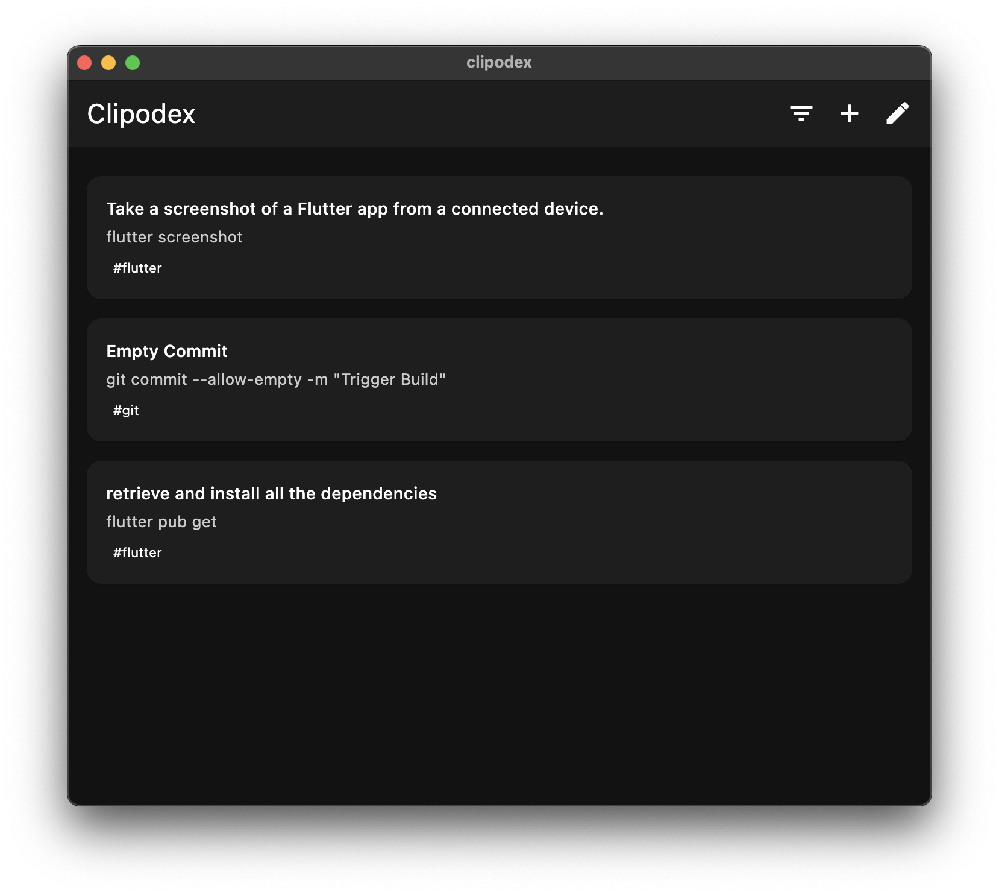
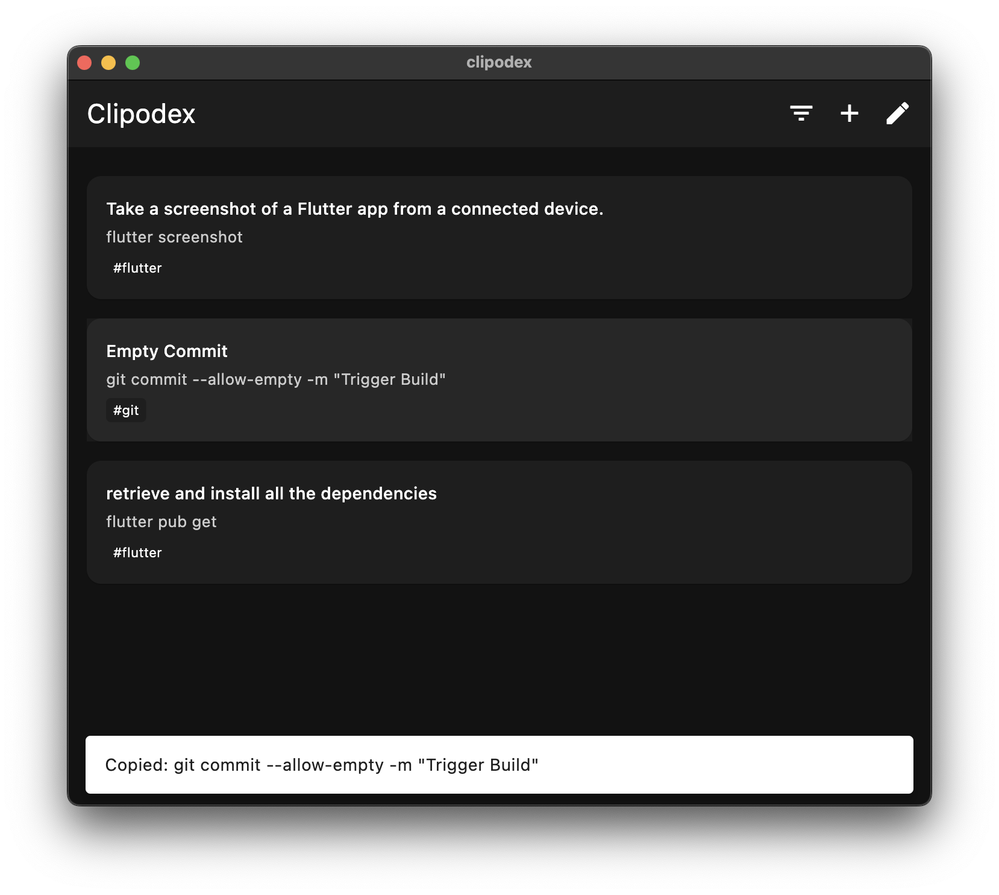
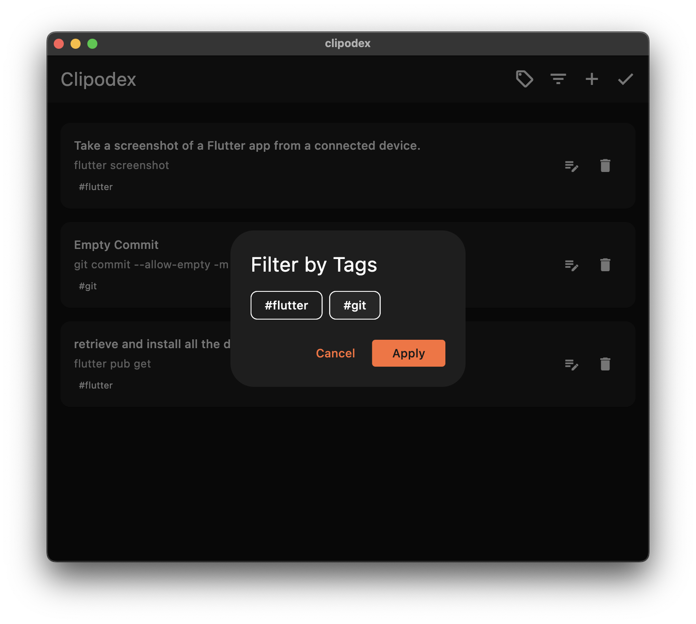
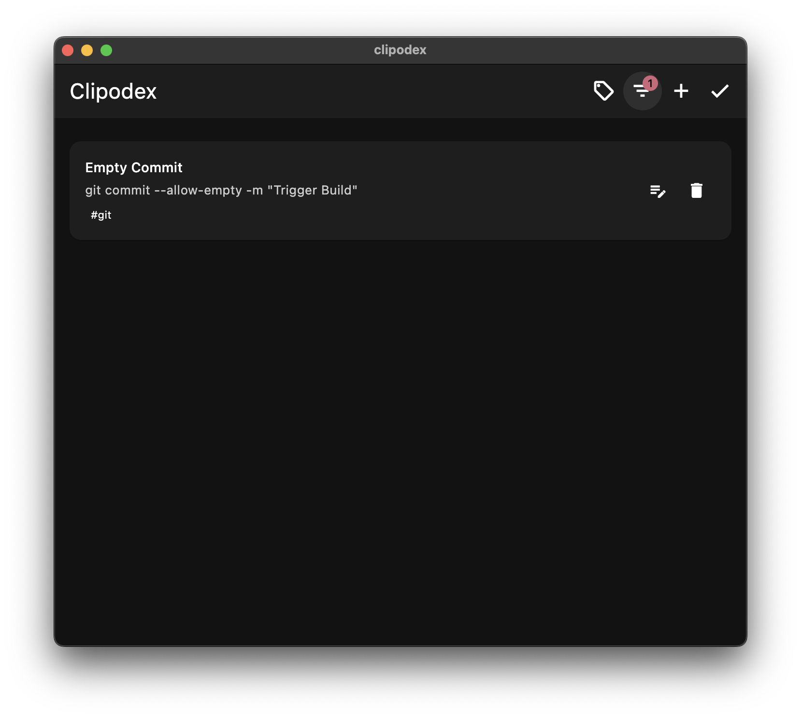

# Clipodex

A minimalist clipboard manager for storing and accessing frequently used text snippets. Built with Flutter for desktop. The more you use it, the better it gets at organizing your frequently used text.





## Quick Start

1. **Save Stuff**
   - Hit + to add something new
   - Give it a title you'll remember
   - Add some tags if you want

2. **Stay Organized**
   - Tap anything to copy it
   - Filter by tags to find things
   - Hit edit to clean up when needed

## Design Principles

1. **Keep It Simple**
   - No folders, just tags to find stuff later
   - Add up to 3 tags per clip
   - Clean interface that stays out of your way
   - One tap to copy anything

2. **Smart Organization**
   - Use tags like hashtags (max 15 total)
   - Filter to find related clips
   - Unused tags clean up automatically
   - Most-used clips float to the top

3. **Focus on Usage**
   - Frequently used clips stay easy to reach
   - Edit mode only when you need it
   - Tag management tucked away until needed
   - Everything adapts to how you use it

## Features

- Save any text you copy often
- One tap to copy
- Find stuff with tags
- Most-used clips sort to top
- Clean up unused tags

## Development

### Prerequisites
- Flutter (latest stable version)
- Dart SDK
- Your preferred IDE (VS Code, Android Studio, etc.)

### Setup
```bash
# Clone the repository
git clone https://github.com/kaling852/clipodex.git

# Navigate to project directory
cd clipodex

# Install dependencies
flutter pub get

# Run the app
flutter run
```

## Contributing

Contributions are welcome! Please feel free to submit a Pull Request.

## License

This project is licensed under the MIT License - see the [LICENSE](LICENSE) file for details.
